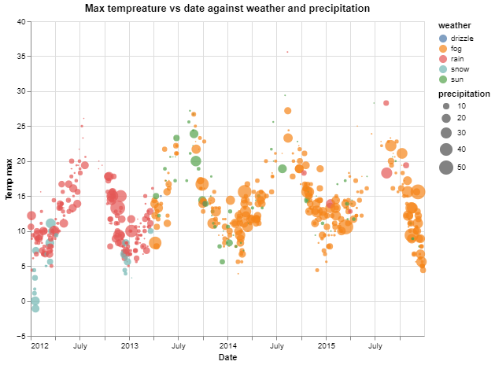
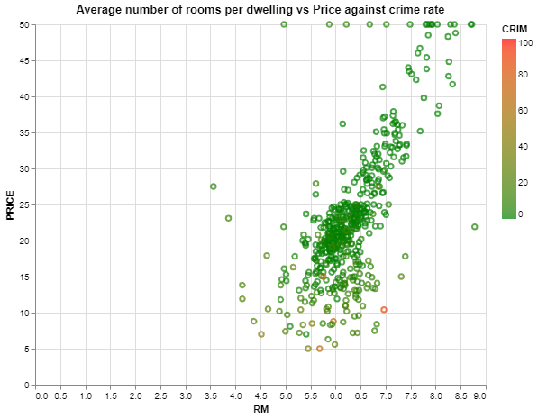

# Data_visualization
This project presents the sample of usage of altair for data visualization.

## Table of contents
* [Visualization weather data](#Visualization weather data)
* [Visualization price data](#Visualization price data)

## Visualization weather data 
* Import libraries 
```
from vega_datasets import data
import os
import altair as alt
import numpy as np
import pandas as pd
```

* Load dataset
```
seattle = data.seattle_weather()
seattle.head()
```

* Relationship between precipitation and date with respective to weather and the size of point by amount of precipitation
```
alt.Chart(seattle).mark_circle().encode(
    alt.X('date', title="Date",scale=alt.Scale(zero=False)),
    alt.Y('temp_max',title="Temp max", scale=alt.Scale(zero=False, padding=1)),
    color='weather',
    size='precipitation',
    tooltip=[alt.Tooltip('date'),
            alt.Tooltip('temp_max'),
            alt.Tooltip('weather'),
            alt.Tooltip('precipitation')]
).properties(width=500,height=400,title="Max tempreature vs date against weather and precipitation")
```


* Precipitation in 2 years every month on detailed and overview chart
```
seattle['date'] = pd.to_datetime(seattle['date'])
seattle['year'] = pd.to_datetime(seattle['date']).dt.year
seattle_2014 = seattle.loc[seattle['date']>'2014-01-01']
seattle_2014['year'] = seattle_2014['year'].astype('category')

zoom = alt.selection_interval(encodings=["x", "y"])

minimap = (
    alt.Chart(seattle_2014)
    .mark_point()
    .add_selection(zoom)
    .encode(
        x="date",
        y="precipitation",
        color=alt.condition(zoom, "year", alt.value("lightgray")),
        tooltip=[alt.Tooltip('year'),
            alt.Tooltip('date'),
            alt.Tooltip('precipitation')]
    
    )
    .properties(
        width=200,
        height=200,
        title="Minimap -- click and drag to zoom in the detail view",
    )
)

detail = (
    alt.Chart(seattle_2014)
    .mark_point()
    .encode(
        x=alt.X(
            "date", scale=alt.Scale(domain={"selection": zoom.name, "encoding": "x"})
        ),
        y=alt.Y(
            "precipitation",
            scale=alt.Scale(domain={"selection": zoom.name, "encoding": "y"}),
        ),
        color="year",
    )
    .properties(title="Precipitation according to year - Detail")
)

detail | minimap
```
.png)

* Precipitation with average rainfall compared to the weather
```
base = alt.Chart(seattle_2015).properties(title="Weather in Seattle in 2015",width=600,height=400)

line = base.mark_line().encode(
    x='date',
    y='precipitation',
    color='weather',
    tooltip=['weather','date','precipitation']
)

rule = base.mark_rule().encode(
    y='average(precipitation)',
    color='weather',
    size=alt.value(2),
    tooltip=['weather','average(precipitation)']
)

line + rule
```
.png)

* Max temperature with varying size of line
```
alt.Chart(seattle_2015).mark_trail().encode(
    alt.X('date'),
    alt.Y('temp_max'),
    size=('temp_max'),
    tooltip=['date','temp_max']
    
).properties(title=" Max temp ",width=600,height=400)
```
.png)

* Precipitation used layered area compared to the weather
```
domain=['drizzle','rain','fog','sun','snow']
range_=['lightseagreen','crimson','violet','blue','green']
alt.Chart(seattle).mark_area(opacity=0.2).encode(
    x="date",
    y=alt.Y("precipitation", stack=None),
    color=alt.Color('weather', scale=alt.Scale(domain=domain, range=range_)),
    tooltip=['weather','date','precipitation']
).properties(title=" Weather in Seattle",width=500,height=350)
```
.png)

* Precipitation distribution with weather diagram
```

alt.Chart(seattle_2015).mark_area().encode(
    x="date",
    y="precipitation",
    color="weather",
    row="weather",
    tooltip=['weather','date','precipitation']
).properties(
    height=100,width=500,title=" weather in Seattle in 2015"
)
```
.png)

* Displays a quantitative representation of the minimum temperatures with positive and negative values compared to the average minimum temperatures
```
mean1=seattle_2015['temp_min'].mean()


alt.Chart(seattle_2015).mark_bar().encode(
    x="date",
    y="temp_min",
    color=alt.condition(
        alt.datum.temp_min > mean1,
        alt.value("steelblue"),  # The positive color
        alt.value("orange")  # The negative color
    ),
    tooltip=['date','temp_min']
).properties(height=400,width=600,title="Average min temp in Seattle in 2015 - negative values")
```
.png)

* Min and max temperatures every year
```
seattle['year'] = seattle['year'].astype('category')
bar = alt.Chart(seattle).mark_bar().encode(
    x='year',
    y='temp_min',
    tooltip=['year','temp_min']
).properties(
    width=alt.Step(20)  # controls width of bar.
).properties(height=400,width=600,title="Min temp (Bar) vs Max temp (Tick) in Seattle")

tick = alt.Chart(seattle).mark_tick(
    color='red',
    thickness=2,
    size=40 * 0.9,   # controls width of tick.
).encode(
    x='year',
    y='temp_max',
    tooltip=['year','temp_max']
)

bar + tick
```
.png)

## Visualization price data 

* Load data
```
from sklearn.datasets import load_boston
boston = load_boston()
```
* Describe the data
```
print(boston.DESCR)
```
* Add target to input data in pandas DataFrame
```
bos = pd.DataFrame(boston.data)
bos.columns = boston.feature_names
bos['PRICE'] = boston.target
print(bos.head())
```
* Show the data summary
```
print(bos.describe())
```

* Show te basic comparision between average number of rooms per dwelling and price
```
alt.Chart(bos).mark_circle().encode(
    alt.X('RM'),
    alt.Y('PRICE'),
    tooltip=[alt.Tooltip('RM'),
            alt.Tooltip('PRICE')]
).configure_mark(color='red').properties(width=600,height=400,title="Average number of rooms per dwelling vs Price")
```
.png)

* Relationship between average number of rooms and price with a categorical field of crime rate
```
domain = ['0','100']
range_dom = ['green', 'red']
alt.Chart(bos).mark_point().encode(
    x='RM',
    y='PRICE',
    color=alt.Color('CRIM', scale=alt.Scale(domain=domain, range=range_dom)),
    tooltip=[alt.Tooltip('RM'),
            alt.Tooltip('PRICE'),
            alt.Tooltip('CRIM')]
).properties(width=500,height=400,title="Average number of rooms per dwelling vs Price against crime rate")
```


* The relationship between B-proportion of blacks, CRIM- crime rate and AGE -proportion of owner-occupied units built prior to 1940 for the tax bracket
```
domain = ['100', '1000']
range_ = ["steelblue", "salmon"]

alt.Chart(bos).mark_circle().encode(
    alt.X(alt.repeat("column"), type='quantitative'),
    alt.Y(alt.repeat("row"), type='quantitative'),
    color=alt.Color('TAX', scale=alt.Scale(domain=domain, range=range_)),
).properties(
    width=150,
    height=150
).repeat(
    row=['B', 'CRIM', 'AGE'],
    column=['AGE', 'CRIM', 'B']
).interactive()
```
.png)

* Relationship of price to tax with respect with area representations with gradient
```
alt.Chart(bos).mark_area(
    line={'color':'darkblue'},
    color=alt.Gradient(
        gradient='linear',
        stops=[alt.GradientStop(color='white', offset=0),
               alt.GradientStop(color='darkblue', offset=1)],
        x1=1,
        x2=1,
        y1=1,
        y2=0
    )
).encode(
    alt.X('PRICE'),
    alt.Y('TAX'),
    tooltip=['PRICE','TAX']
).properties(title="Price vs Tax",width=600,height=400)
```
.png)


## Status
Project is: _in progress_
